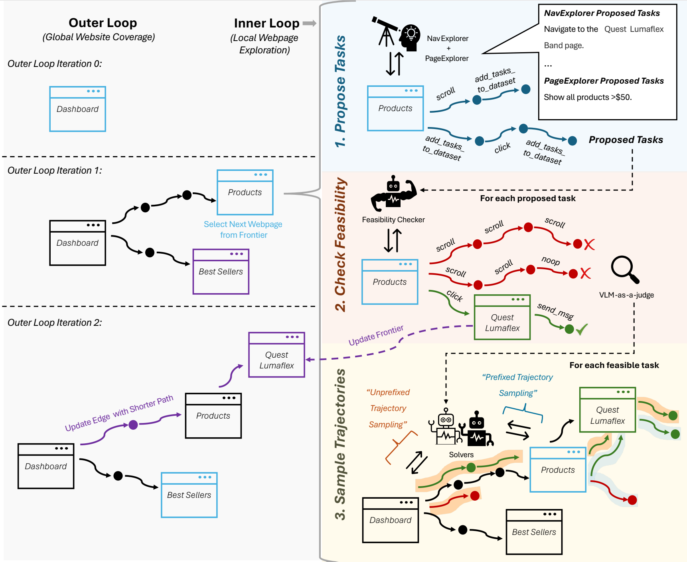

<div align="center">
  <h1>Go-Browse: Training Web Agents with Structured Exploration</h1>
  <a href="https://arxiv.org/abs/2506.03533">
    
  </a>
  <!-- <a href="https://img.shields.io/badge/PRs-Welcome-red">
    
  </a> -->
  
</div>

## Table of Contents
- [Overview](#overview)
- [Setup](#setup)
- [Collect Dataset](#collect-dataset)
  - [Process Collected Go-Browse Dataset for Training](#process-collected-go-browse-dataset-for-training)
  - [Process NNetNav Dataset for Training](#process-nnetnav-dataset-for-training)
- [Finetune a Model](#finetune-a-model)
- [Benchmark a Model on WebArena](#benchmark-a-model-on-webarena)
- [Run an Episode on a Website](#run-an-episode-on-a-website)
- [Go-Browse-WA Dataset and Trained Models Release](#go-browse-wa-dataset-and-trained-models-release)
- [Citation](#citation)


## Overview

Go-Browse is a method for automatic, unsupervised collection of high-quality and diverse web agent training data via structured exploration of websites. 

Go-Browse has an outer loop that iteratively builds up a graph of previously visited webpages on a website (incentivizing global website coverage) and an inner loop that thoroughly explores each discovered webpage by: (1) Proposing tasks to solve on that page and tasks to discover neighboring pages; (2) Filtering these tasks to feasible ones by trying to solve them and judging successes with a strong computer-use LM + a VLM-as-a-judge and (3) Sampling additional task-solving trajectories with various other pretrained LMs.



By resetting the inner loop to previously discovered webpages, the outer loop helps Go-Browse reuse information across the multiple inner loop invocations, enabling more efficient and deeper exploration of websites.

We release [Go-Browse-WA](#go-browse-wa-dataset-and-trained-models-release), a dataset collected by running Go-Browse on 100 webpages from WebArena websites, collecting ~10K successful task-solving trajectories and ~17K unsuccessful ones.

Finetuning Qwen-2.5-7B-Instruct on Go-Browse-WA achieves state-of-the-art performance for sub-10B parameter models on the WebArena benchmark with a overall success rate of 21.7%, beating the previous best finetuned sub-10B model by 2.9 percentage points and beating GPT-4o-mini by 2.4 percentage points.

## Setup

Note, we ran our experiments with Python 3.12, though earlier python versions may also work.

1. Follow the instructions here to install browsergym with webarena and playwright with chromium: https://github.com/ServiceNow/BrowserGym
2. Install `webexp` and dependencies:
```sh
pip install -r requirements.txt
pip install -e .
```
3. Setup a WebArena Server using the instructions here: [webarena readme](https://github.com/web-arena-x/webarena/blob/main/environment_docker/README.md). You can also optionally setup the a reset server to remotely reset the webarena environments by: 
    - Copy/clone over the webarena-reset folder to your webarena hosting instance
    - `pip install fastapi[standard]` on this instance.
    - `cd webarena-reset`
    - `export BASE_URL=<PUBLIC URL for your instance>`
    - `fastapi run reset_server.py`
    - You can now reset a specific domain at once (e.g. map with `<RESET_SERVER_URL>/reset/map`) or all domains at once with (e.g., `<RESET_SERVER_URL>/reset/all`).

## Collect Dataset
Example config file used for Go-Browse-WA data generation is: `configs/go_browse_config.yaml`

For each domain (website) that you want to run data generation for, duplicate/modify the config file by filling in placeholders and then run:
```sh
python -m webexp.explore.algorithms.web_explore -c configs/web_explore_config.yaml
```

### Process Collected Go-Browse Dataset for Training
First, set the input and output paths as appropriate in `projects/go-browse/data/generate_dataset.py` and `projects/go-browse/data/process_dataset.py`

Then:
```sh
python projects/go-browse/data/generate_dataset.py
python projects/go-browse/data/process_dataset.py
```

### Process NNetNav Dataset for Training
First, set the output path as appropriate in `projects/go-browse/data/process_nnetnav_data.py`

Then:
```
python projects/go-browse/data/process_nnetnav_data.py
```

## Finetune a Model
First, replace the placeholder paths/env vars as appropriate in `webexp/train/sft_policy.py`

Then:
```
python webexp/train/sft_policy.py
```

## Benchmark a Model on WebArena
If benchmarking a finetuned model, first serve the model using an inference server like [vllm](https://docs.vllm.ai/en/latest/) or [sglang](https://docs.sglang.ai/). We used `vllm` in our experiments.

Duplicate/edit the following config file by filling in the placeholders: `configs/benchmark_webarena.yaml`.

Then:
```
python -m webexp.benchmark.run_webarena -c configs/benchmark_webarena.yaml
```

## Run an Episode on a Website
If performing inference with a finetuned model, first serve the model using an inference server like [vllm](https://docs.vllm.ai/en/latest/) or [sglang](https://docs.sglang.ai/).

Duplicate/edit the following config file by filling in the placeholders: `configs/benchmark_webarena.yaml`.

Then:
```
python -m webexp.agents.run_episode -c configs/benchmark_webarena.yaml
```

## Go-Browse-WA Dataset and Trained Models Release

Processed version of the dataset used for our finetuning results (output of `projects/go-browse/data/process_dataset.py`): [go-browse-wa](https://huggingface.co/datasets/apurvaga/go-browse-wa).
This dataset includes both successful and unsuccessful trajectories. All experiments from the paper can be reproduced with this version of the dataset by filtering to just the successful trajectories.

Raw version of the dataset with screenshots and additional observation representations will be released soon.

Finetuned models (on HF Hub):
- [go-browse-wa-qwen-7B](https://huggingface.co/apurvaga/go-browse-wa-qwen-7B)
- [nnetnav-wa-qwen-7B](https://huggingface.co/apurvaga/nnetnav-wa-qwen-7B)

## Citation
```bibtex
@misc{gandhi2025gobrowse,
      title={Go-Browse: Training Web Agents with Structured Exploration}, 
      author={Apurva Gandhi and Graham Neubig},
      year={2025},
      eprint={2506.03533},
      archivePrefix={arXiv},
      primaryClass={cs.CL},
      url={https://arxiv.org/abs/2506.03533}, 
}
```